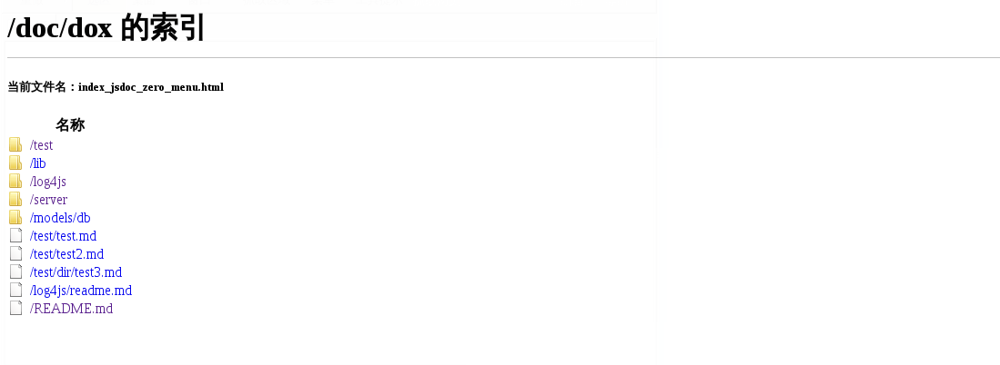
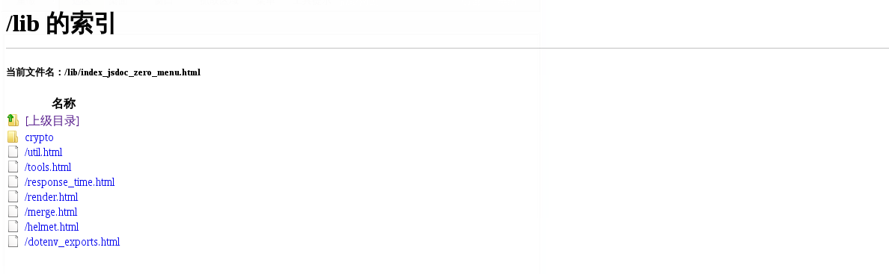
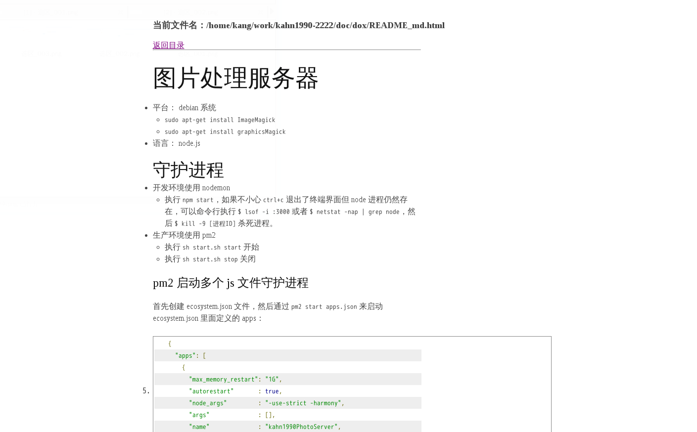
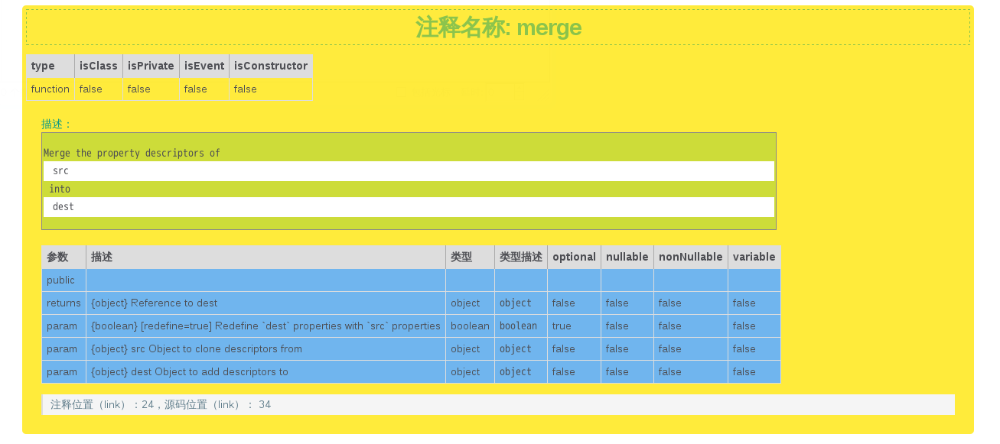

JSDOC-ZERO 
[![NPM Version][npm-image]][npm-url]
[![NPM Downloads][downloads-image]][downloads-url]
[npm-image]: https://img.shields.io/npm/v/jsdoc-zero.svg?style=flat
[npm-url]: https://npmjs.org/package/jsdoc-zero
[downloads-image]: https://img.shields.io/npm/dm/jsdoc-zero.svg?style=flat
[downloads-url]: https://npmjs.org/package/jsdoc-zero
===========================================================================
## 简介 (Introductions)

基于 jsdoc 规范，适用于工程较大、文件内容较多、文件夹层次较深的项目。
Based on the JSDoc specification, the project is suitable for the larger project, the document content, the folder level of the project.

## 安装 (Installation)
安装 JSDOC-ZERO 为全局工具：
Install JSDOC-ZERO as global tool:

```
$ npm install jsdoc-zero -g
```

## 使用 (Use)

### 建立配置文件 (Create configuration file)

首先在项目根目录下建立 `dox.config.json` 文件，默认内容为：
First, the project root directory to establish the `dox.config.json` file, the default content:

```
{
  "name"     : "default",
  "version"  : "0.0.1",
  "source"   : {
    "include": [
      "lib"
    ],
    "exclude": [
      "node_modules"
    ],
    "suffix" : [
      ".js"
    ],
    "output" : "doc/dox"
  }
}
```

其中含义：

- name : 项目名称
- version : 版本号码
- source
    - include : 待检查目录的集合，默认检查 `lib` 文件夹
    - exclude : 需要过滤的目录集合，默认过滤 `node_modules` 文件夹
    - suffix : 待检查文件的后缀名，默认检查 `js` 文件和 `md` 文件
    - output : 输出目录，默认输出 `doc/dox`

Which meaning:

- Name: project name
- version: version number
- source
    - include: the collection of the directory to be checked, the default check `lib` folder
    - exclude: you need to filter the directory collection, the default filter `node_modules` folder
    - suffix: to check the file suffix, the default check `js` files and `md` files
    - output: output directory, the default output `doc/dox`

使用的时候直接在项目根目录下执行 `jdz build`。
When used directly in the project root directory `jdz build`.

### 命令行使用 (Command line usage)

为了简单直白，我只保留了 `build` 功能，相关的参数也只有 `-o` 和 `-d`：
In order to straightforward, I only keep the `build` function, only `-o` and `-d` related parameters:

- `-o` : 指定输出目录，如 `-o doc/box`
- `-d` : 指定待检查目录的集合，如 `-d ['lib', 'server']`

- `-o`: specify the output directory, such as `-o doc/box`
- `-d`: Specifies the collection of the list to be checked, such as `-d ['lib', 'server']`

在命令行直接执行：`jdz build -o doc/box -d ['lib', 'server']`，并且 `-o` 缺省为默认配置文件中的 `doc/dox`，`-d` 缺省为默认配置文件中的 `['lib']`。
Execute directly on the command line: `jdz build -o doc/box -d ['lib''server']`, and `-o` default as the default configuration file in the `doc/dox`, `-d` default to the default configuration file in the `['lib']`.

### 注意 (Careful)

JSDOC-ZERO 每次生成文档的时候都会清空 `输出目录` 下的所有文件。
JSDOC-ZERO every time the document will be generated when the output directory of all the documents.

### 效果图 (Sample picture)

首先 JSDOC-ZERO 会在输出目录下建立一个索引文件： `index_jsdoc_zero_menu.html`，包含`待检查目录的集合`和其（包括子目录）目录下的所有 `md` 文件。
First JSDOC-ZERO will be in the output directory to create an index file: `index_jsdoc_zero_menu.html`, containing the 'to be checked in the directory' and its (including sub directory) directory of all the `md` files.



每一层文件夹逐一对应项目中 `待检查目录` 的文件夹：



`md` 文件效果图：



生成的 `JSDOC` 规范的文件：


黄色代表普通的注释，而红色代表输出到 `exports` 上的对象的注释，注释的具体细节：



### 模版

关于模板我想了很长时间，一个工具应该以简洁直白为标准应该是最好的，所以即便添加自定义模板很简单，但我还是 pass 了这个功能，希望构建自己喜欢的样式，可以自行 fork [jsdoc-zero](https://github.com/kahn1990/jsdoc-zero) 更改里面的样式，记得点右上角的星星 (╬▔▽▔)凸。

### 依赖
依赖于 TJ 的 [dox](https://github.com/tj/dox)。
