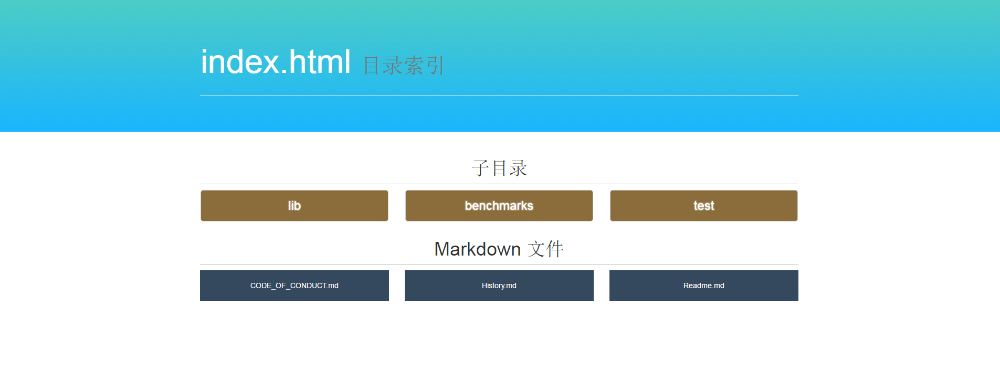
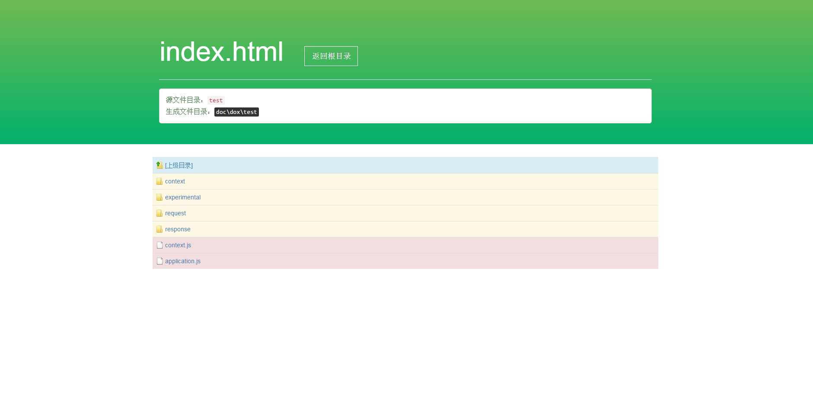
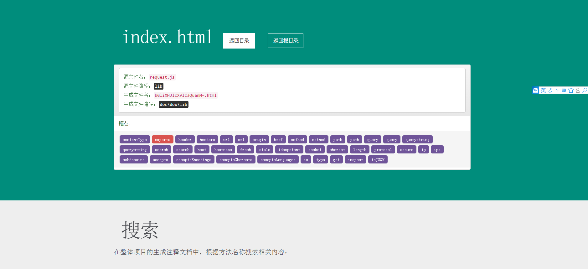
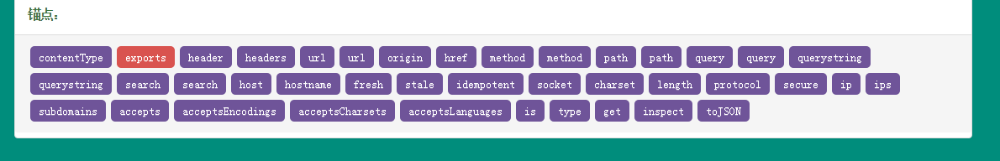
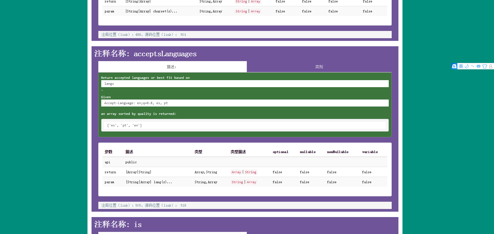
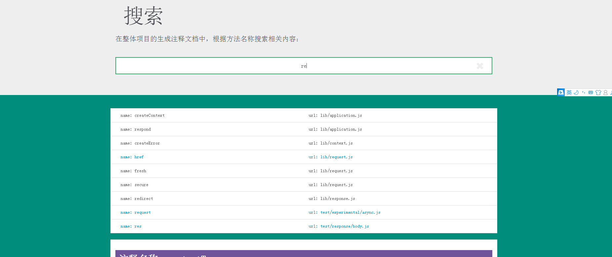
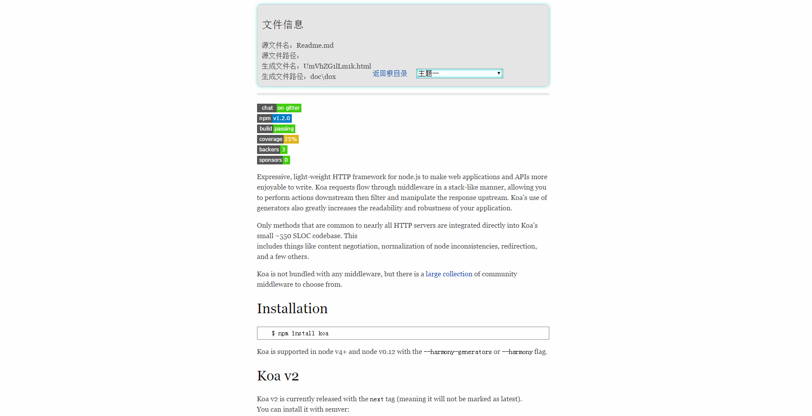
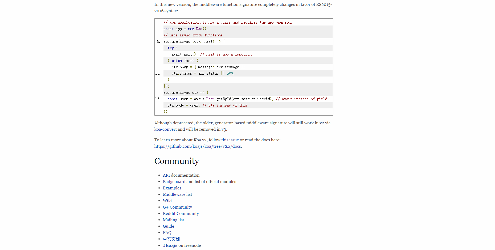

JSDOC-ZERO 
[![NPM Version][npm-image]][npm-url]
[![NPM Downloads][downloads-image]][downloads-url]
[npm-image]: https://img.shields.io/npm/v/jsdoc-zero.svg?style=flat
[npm-url]: https://npmjs.org/package/jsdoc-zero
[downloads-image]: https://img.shields.io/npm/dm/jsdoc-zero.svg?style=flat
[downloads-url]: https://npmjs.org/package/jsdoc-zero
===========================================================================
## 简介 (Introductions)

基于 jsdoc 规范，适用于工程较大、文件内容较多、文件夹层次较深的项目。

## 安装 (Installation)
安装 JSDOC-ZERO 为全局工具：

```
$ npm install jsdoc-zero -g
```

## 使用 (Use)

### 建立配置文件 (Create configuration file)

首先在项目根目录下建立 `dox.config.json` 文件，默认内容为：

```
{
  "name"     : "default",
  "version"  : "0.0.1",
  "source"   : {
    "include": [
      "lib"
    ],
    "exclude": [
      "node_modules"
    ],
    "suffix" : [
      ".js"
    ],
    "output" : "doc/dox"
  }
}
```

其中含义：

- name : 项目名称
- version : 版本号码
- source
    - include : 待检查目录的集合，默认检查 `lib` 文件夹
    - exclude : 需要过滤的目录集合，默认过滤 `node_modules` 文件夹
    - suffix : 待检查文件的后缀名，默认检查 `js` 文件和 `md` 文件
    - output : 输出目录，默认输出 `doc/dox`

新建文件 `dox.config.json` 完成之后，根据自己的具体项目完善配置文件，然后在当前项目的根目录下的命令行中执行命令：

```js
$ jdz build
```
此时 `jdz` 会自动寻找项目跟目录下的 `dox.config.json` 文件进行相关操作。

### 命令行使用 (Command line usage)

如果想要在命令行直接使用，为了简单直白，我只保留了 `build` 功能，相关的参数也只有 `-o` 和 `-d`：

- `-o` : 指定输出目录，如 `-o doc/box`
- `-d` : 指定待检查目录的集合，如 `-d ['lib', 'server']`

在命令行直接执行：`jdz build -o doc/box -d ['lib', 'server']`，并且 `-o` 缺省为默认配置文件中的 `doc/dox`，`-d` 缺省为默认配置文件中的 `['lib']`。

### 注意 (Careful)

JSDOC-ZERO 每次生成文档的时候都会清空 `输出目录` 下的所有文件。

### 效果图 (Sample picture)

首先 JSDOC-ZERO 会在输出目录下建立一个索引文件： `index.html`，包含`待检查目录的集合`和其（包括子目录）目录下的所有 `md` 文件。



每一层文件夹逐一对应项目中 `待检查目录` 的文件夹：



然后一层一层递归：


生成的 `JSDOC` 规范的文件，在文件开头包含基本的文件信息：



这里设置了页面方法的锚点，用于快速跳转：



相关细节（黄色代表普通的注释，而红色代表输出到 `exports` 上的对象的注释，注释的具体细节）：



新增的搜索功能：


可根据输入的注释方法名称，寻找相关的注释文件，点击后跳转到相关文件：



`md` 文件效果图：



对于代码标色的问题，这里只是做了简单的处理，所以可能看上去有一点单调：


### 模版

关于模板我想了很长时间，一个工具应该以简洁直白为标准应该是最好的，所以即便添加自定义模板很简单，但我还是 pass 了这个功能，希望构建自己喜欢的样式，可以自行 fork [jsdoc-zero](https://github.com/kahn1990/jsdoc-zero) 更改里面的样式，记得点右上角的星星 (╬▔▽▔)凸。

### 依赖
依赖于 TJ 的 [dox](https://github.com/tj/dox)。

### 更新

#### `2016/7/15`

1. 修改部分代码写法，增强可阅读性
1. 修改所有页面的 css 样式
1. 增加相对静态路径，将 js 等静态资源从 cdn 转为本地静态资源
1. 增加文件相关信息
1. 增加搜索功能，可以根据相关注释方法名搜索到相应文件
1. 增加返回根目录功能以及生成文件名用 base64 处理
